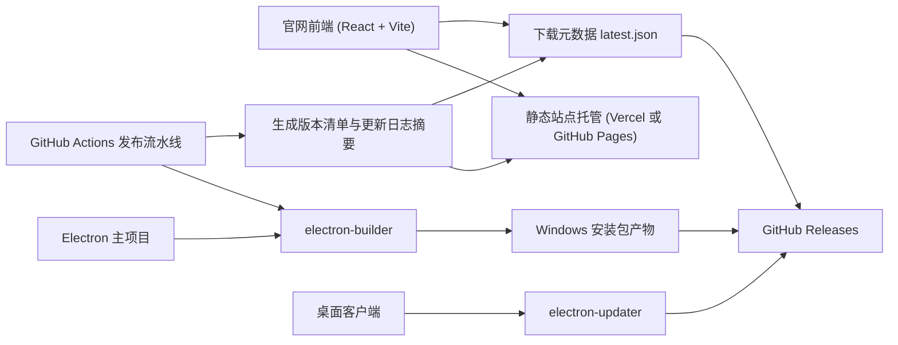
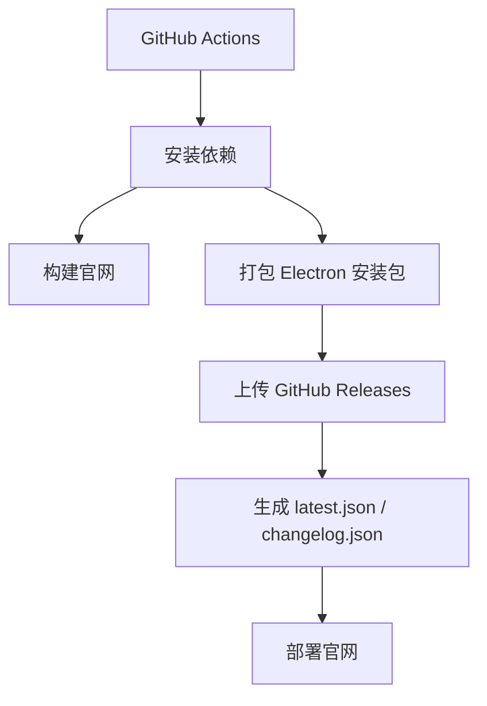
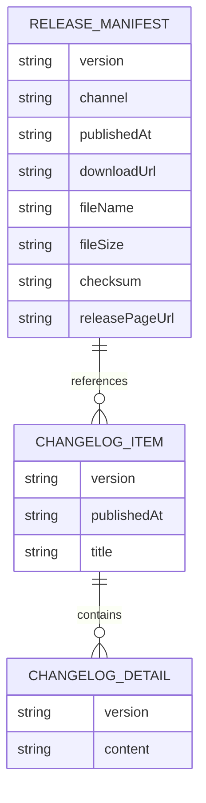

## 1. 架构设计



## 2. 技术说明
- 官网前端：React 19 + Vite 8 + TypeScript。
- 官网样式：推荐 `Tailwind CSS` 或 CSS Modules；若保持现有项目风格一致，可继续使用模块化 CSS。
- 官网部署：默认推荐 `Vercel`，备选 `GitHub Pages`。
- Electron 打包：`electron-builder`。
- Electron 自动更新：`electron-updater`。
- Release 存储：`GitHub Releases`。
- 流水线：`GitHub Actions`。
- 下载页版本元数据：发布时自动生成 `latest.json`，由官网读取展示。
- 发布 Skill：自定义 `.trae/skills/electron-release-publisher/SKILL.md`，统一维护发布步骤。

## 3. 路由定义
| 路由 | 用途 |
|-------|---------|
| / | 官网首页，展示产品定位、亮点、使用方式、下载入口 |
| /download | 下载页，展示最新版本、平台说明、历史版本入口 |
| /changelog | 更新说明页，展示版本日志、Demo 说明、FAQ |

## 4. API 定义
本方案优先采用静态站点，不引入独立后端。官网通过读取构建产出的静态 JSON 展示最新版本信息。

```ts
export interface ReleaseManifest {
  version: string
  channel: 'demo' | 'stable' | 'beta'
  publishedAt: string
  downloadUrl: string
  fileName: string
  fileSize?: string
  notes: string[]
  checksum?: string
  releasePageUrl: string
}

export interface ChangelogItem {
  version: string
  publishedAt: string
  title: string
  summary: string[]
}
```

静态资源建议：
- `/releases/latest.json`：官网首页和下载页读取的最新版本信息。
- `/releases/changelog.json`：更新说明页渲染的版本日志。

## 5. 服务架构图
本阶段不引入独立服务端，发布系统以 CI 工作流代替后端服务。



## 6. 数据模型
### 6.1 数据模型定义



### 6.2 数据定义语言
本阶段使用 JSON 文件而非数据库，避免为官网引入不必要复杂度。

`latest.json` 示例：

```json
{
  "version": "0.1.0-demo.1",
  "channel": "demo",
  "publishedAt": "2026-06-12T12:00:00Z",
  "downloadUrl": "https://example.com/downloads/BattleLedger-Setup-0.1.0-demo.1.exe",
  "fileName": "BattleLedger-Setup-0.1.0-demo.1.exe",
  "fileSize": "86 MB",
  "notes": [
    "新增桌宠悬浮入口",
    "支持自动识别历史同队关系",
    "提供轻量搜索与详情查看"
  ],
  "checksum": "sha256:demo",
  "releasePageUrl": "https://github.com/<owner>/<repo>/releases/tag/v0.1.0-demo.1"
}
```

## 7. 发布方案
- 首次发布目标：上线一个正式官网，并提供 `Windows Demo` 安装包下载。
- 后续更新目标：每次只需要更新版本号、更新日志并执行统一发布命令，即可自动完成构建、上传和官网同步。
- 推荐流程：
  1. 在项目中新增 `electron-builder` 配置与打包脚本。
  2. 使用 GitHub Actions 构建 Windows 安装包并上传 Release。
  3. 在同一流水线中生成 `latest.json` 和 `changelog.json`。
  4. 自动部署官网到 `Vercel` 或 `GitHub Pages`。
  5. 客户端后续接入 `electron-updater`，实现提示用户下载或自动更新。

## 8. 发布 Skill 设计
- Skill 名称建议：`electron-release-publisher`
- 触发条件：当用户要求“发布官网”“发布 Electron 安装包”“生成新版本下载”“同步最新版本信息”时调用。
- Skill 目标：
  - 检查版本号与更新日志。
  - 构建官网和 Electron 安装包。
  - 触发发布命令或生成可执行发布步骤。
  - 校验下载链接与版本元数据是否同步。
- Skill 输出：
  - 本次版本号
  - 发布产物路径
  - 官网部署地址
  - 下载地址
  - 回滚说明

## 9. 代码组织建议
- `website/`：独立官网前端项目，避免与 Electron 渲染层 UI 混杂。
- `website/src/pages/`：首页、下载页、更新说明页。
- `website/public/releases/`：发布阶段生成的静态版本元数据。
- `.github/workflows/release.yml`：构建官网与 Electron 发布流水线。
- `.trae/skills/electron-release-publisher/SKILL.md`：统一发布 Skill。

## 10. 外部依赖选择原则
- 不重复造轮子，优先使用成熟方案：
  - Electron 打包：`electron-builder`
  - Electron 更新：`electron-updater`
  - 官网部署：`Vercel` 或 `GitHub Pages`
  - CI/CD：`GitHub Actions`
- 若后续需要下载统计或邮件通知，再增量接入外部服务，不在首版引入。
