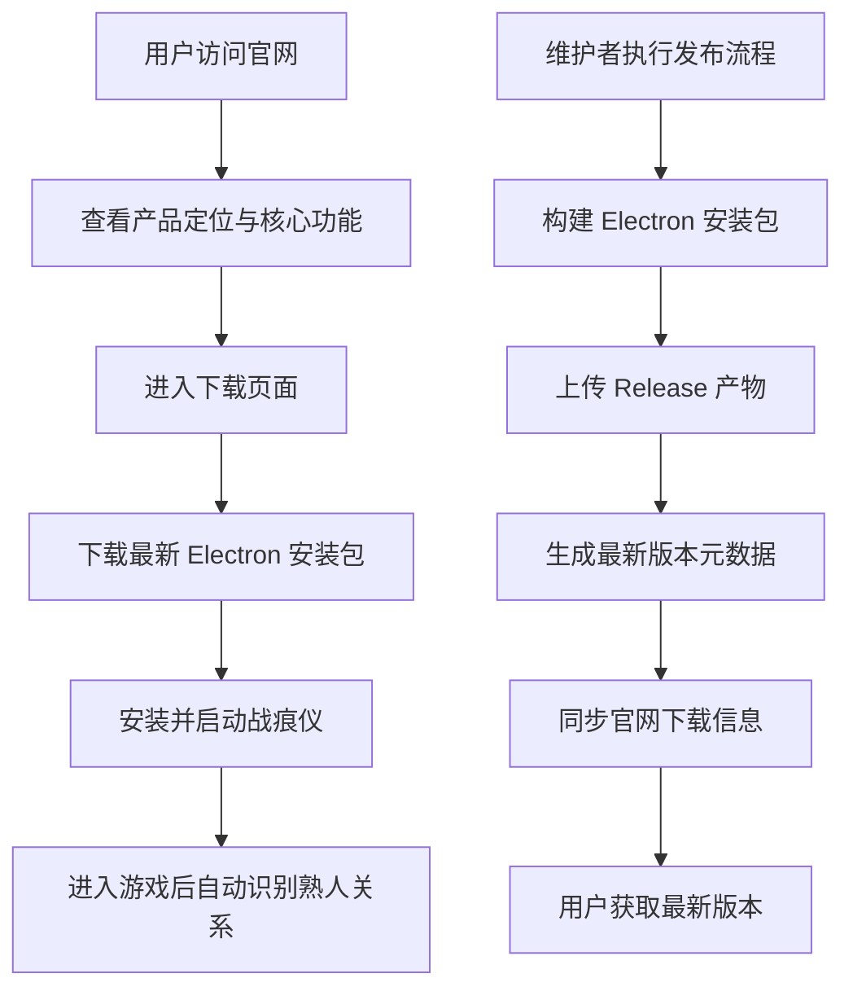

## 1. 产品概述
为 `战痕仪` 提供一个正式的产品官网，用来介绍这款面向三角洲玩家的 Electron 游戏记录助手，并提供稳定、清晰的下载入口与版本发布说明。
- 解决“Demo 无法被清楚介绍、无法稳定下载、后续更新不方便发布”的问题。
- 面向三角洲玩家、内容创作者、测试用户，提升产品可信度、传播效率与后续迭代发布效率。

## 2. 核心功能

### 2.1 用户角色
| 角色 | 进入方式 | 核心权限 |
|------|----------|----------|
| 普通访客 | 直接访问官网 | 浏览产品介绍、查看功能亮点、下载最新版本、查看版本说明 |
| 产品维护者 | 通过 GitHub Actions 发布 | 触发自动构建、上传 Electron 安装包、同步官网最新下载信息 |

### 2.2 功能模块
1. **官网首页**：产品定位、核心价值、桌宠形态展示、使用场景、功能亮点、信任说明。
2. **下载页面**：最新版本下载、平台信息、版本号、发布时间、安装说明、历史版本入口。
3. **更新说明页面**：版本更新记录、Demo 状态说明、后续规划、常见问题。

### 2.3 页面详情
| 页面名称 | 模块名称 | 功能描述 |
|-----------|-------------|---------------------|
| 官网首页 | Hero 首屏 | 展示产品名、核心一句话介绍、桌宠视觉、下载主按钮、查看功能按钮 |
| 官网首页 | 产品亮点 | 用清晰卡片说明自动识别熟人队友、历史匹配查询、击杀关系追踪、轻量桌宠体验 |
| 官网首页 | 使用流程 | 说明“启动桌宠 -> 进入游戏 -> 自动识别 -> 手动补充搜索 -> 查看详情”的闭环 |
| 官网首页 | 信任说明 | 说明本地日志读取、数据用途、Demo 阶段范围、不会做夸大承诺 |
| 下载页面 | 最新版本下载区 | 展示当前最新版本、系统要求、主下载按钮、哈希/构建时间、Demo 标识 |
| 下载页面 | 历史版本区 | 展示历史版本列表或跳转到 Release 页面 |
| 下载页面 | 安装说明 | 说明 Windows 下载、安装、权限提示、更新方式 |
| 更新说明页面 | 版本日志 | 按版本展示新增功能、修复内容、已知问题 |
| 更新说明页面 | Demo 说明 | 说明当前为 Demo 发布，后续会持续迭代 |
| 更新说明页面 | 常见问题 | 说明下载失败、杀毒误报、日志权限、更新获取方式 |

## 3. 核心流程
访客通过官网了解 `战痕仪` 的定位与亮点，点击下载页获取最新安装包；维护者后续只需执行统一发布流程，即可自动构建 Electron 安装包、生成最新版本信息并同步到官网下载页。

## 4. 用户界面设计
### 4.1 设计风格
- 主色：深海蓝、冷灰蓝、少量高亮青色。
- 辅色：低饱和雾紫、金属银，用于层次和轻提示。
- 按钮风格：圆角胶囊按钮，主按钮采用高质感发光描边，次按钮用半透明玻璃态。
- 字体建议：中文采用更有质感的现代无衬线组合，避免通用默认字；标题和正文字体分离，突出产品感。
- 布局风格：桌面优先、强首屏、大片留白、细腻玻璃层与柔和阴影，不使用厚黑边框。
- 图标建议：简洁线性图标，配合少量状态徽章，不使用臃肿的信息块。

### 4.2 页面设计概览
| 页面名称 | 模块名称 | UI 元素 |
|-----------|-------------|-------------|
| 官网首页 | Hero 首屏 | 桌宠主视觉、产品名、标语、下载按钮、淡光背景、动态粒子/网格纹理 |
| 官网首页 | 功能亮点 | 三到四张高对比功能卡，突出“自动识别熟人”“历史同队”“击杀关系” |
| 官网首页 | 使用流程 | 横向步骤条、轻动画连线、桌宠与搜索窗组合示意 |
| 官网首页 | 信任说明 | 简明文本、半透明容器、无厚重边框 |
| 下载页面 | 最新版本区 | 大号版本卡、平台徽标、下载按钮、版本号、发布时间 |
| 下载页面 | 历史版本区 | 干净列表、标签、跳转按钮 |
| 更新说明页面 | 版本日志 | 时间线排版、版本标签、模块化更新内容 |

### 4.3 响应式
- 采用桌面优先设计，优先服务 PC 玩家访问与下载。
- 平板和手机端保留产品介绍与下载说明，但将下载主流程聚焦为“查看版本 + 引导到桌面下载”。
- 关键按钮与版本信息在小屏下保持完整可见。

### 4.4 内容语气
- 语气简洁、专业、克制，不夸大、不空泛。
- 文案重点强调“本地日志识别”“自动提醒熟人关系”“适合三角洲玩家”。
- Demo 版本要明确标注“当前为公开体验版”。
